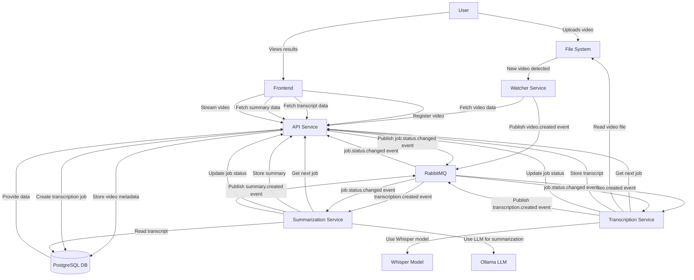

# Video Transcriber

Prototype application for automatic video transcription and summarization.

## Overview

Video Transcriber is a hobby project for processing video files, generating transcriptions, and creating summaries.

## Features

- **Automatic Video Detection**: Monitors directories for new video files
- **Speech-to-Text Transcription**: Converts spoken content to text using Whisper
- **AI-Powered Summarization**: Generates concise summaries using Ollama LLM
- **Web Interface**: User-friendly frontend for viewing videos, transcripts, and summaries
- **API Access**: RESTful API for programmatic access to all features
- **Job Queue System**: Efficient processing of multiple videos

## Architecture

The application follows a microservices architecture with the following components:



### Services

- **API Service**: HTTP API for video management, transcript/summary retrieval, and job monitoring
- **Transcription Service**: Processes videos and generates transcripts using Whisper
- **Summarization Service**: Creates summaries from transcripts using Ollama LLM
- **Watcher Service**: Monitors directories for new video files
- **Frontend**: React-based web interface for user interaction

### Communication

The system uses a combination of two approaches for service communication:

1. **Event-Driven (Push Model)**: Services subscribe to specific events via RabbitMQ
2. **Polling (Pull Model)**: Services periodically check the API for pending jobs

## Installation

### Prerequisites

- Docker and Docker Compose
- Git

### Quick Start

1. Clone the repository:

   ```bash
   git clone https://github.com/yourusername/video-transcriber.git
   cd video-transcriber
   ```

2. Initialize the project:

```
docker-compose up
```

## Usage

### Processing Videos

1. Place video files in the `data/videos` directory
2. The system will automatically detect, transcribe, and summarize the videos
3. View the results in the web interface

## API Endpoints

### Authentication

- `POST /auth/token`: Get an access token
- `POST /auth/register`: Register a new user (admin only)
- `GET /auth/me`: Get current user information

### Videos

- `POST /videos/upload`: Upload a new video
- `GET /videos`: List all videos
- `GET /videos/{video_id}`: Get video details
- `DELETE /videos/{video_id}`: Delete a video

### Transcripts

- `GET /transcripts`: List all transcripts
- `GET /transcripts/{transcript_id}`: Get transcript details
- `GET /transcripts/video/{video_id}`: Get transcript for a video

### Summaries

- `GET /summaries`: List all summaries
- `GET /summaries/{summary_id}`: Get summary details
- `GET /summaries/transcript/{transcript_id}`: Get summary for a transcript

### Jobs

- `GET /jobs`: List all jobs
- `GET /jobs/{job_id}`: Get job details
- `GET /jobs/status/{status}`: List jobs by status

## Development

### Project Structure

```
video-transcriber/
├── common/                 # Shared code between services
├── data/                   # Data storage
│   ├── videos/             # Video files
├── frontend/               # React frontend
├── services/               # Backend services
│   ├── api_service/        # HTTP API
│   ├── transcription_service/ # Video transcription
│   ├── summarization_service/ # Transcript summarization
│   └── watcher_service/    # File system monitoring
└── docker-compose.yml      # Docker configuration
```

### Local Development

For local development of individual services, refer to the README.md in each service directory.

## Configuration

The application can be configured through environment variables:

- `VIDEO_DIRS`: Directories to monitor for videos (default: `/app/data/videos`)
- `MAX_WORKERS`: Maximum number of transcription worker threads (default: `2`)
- `LLM_MODEL`: Ollama model to use for summarization (default: `deepseek-r1`)
- `LLM_HOST`: URL of the Ollama API (default: `http://ollama:11434/api/generate`)
