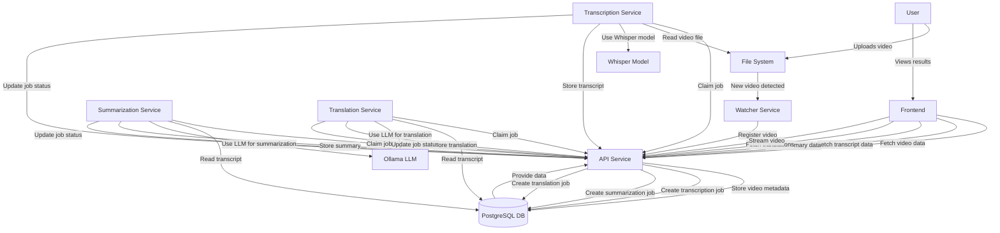

# Video Transcriber

Privacy-first application for automatic video transcription, summarization, translation, and transcript review.

## Overview

Video Transcriber is a hobby project for processing video files, generating transcriptions, and creating summaries.

## Features

- **Automatic Video Detection**: Monitors directories for new video files
- **Speech-to-Text Transcription**: Converts spoken content to text using WhisperX
- **AI-Powered Summarization**: Generates concise summaries using Ollama
- **Profile-Aware Summaries**: Supports generic, meeting, podcast, lecture, and interview summary profiles
- **Structured Summary Enrichments**: Persists and renders chapters, highlights, keywords, action items, named entities, open questions, and risks
- **On-Demand Translation**: Creates translated transcripts for supported languages
- **Expanded Translation Targets**: Supports a broader local-first language set including German, Italian, Dutch, Portuguese, Korean, and Chinese
- **Translation Controls**: Supports optional per-request style-guide instructions and glossary terms
- **Subtitle QA Metrics**: Stores line-length, reading-speed, overlap, and missing-speaker warnings on translated transcripts
- **Server-Generated Exports**: Downloads `txt`, `srt`, and `vtt` assets from the backend
- **Revision History**: Stores transcript edit history and allows revision restore
- **Persisted Speaker Names**: Saves speaker aliases with the transcript instead of only in the browser
- **Review Workflow**: Persists transcript review status, assignee, and timestamp-linked comments
- **Normalized Segment Rows**: Mirrors transcript and translation segments into relational tables for future collaboration and QA features
- **Filterable Search**: Supports transcript search filters for speaker, language, review state, and video title
- **Expanded Backend Exports**: Generates `txt`, `srt`, `vtt`, `json`, `ass`, and transcript review packages from the backend
- **Saved Library Views**: Persists library filters, layout mode, and named saved views in the frontend workspace
- **Backend Download State**: Shows export preparation state in the transcript workspace while backend-generated assets download
- **Backend-Agnostic Storage URIs**: Supports canonical local paths today and mounted `s3://` object-store identities for self-hosted setups
- **Web Interface**: Frontend for viewing videos, transcripts, summaries, and translations
- **Unified Jobs API**: Shared orchestration view with attempt history, cancellation, retry, and progress tracking
- **WebSocket Realtime + SSE Fallback**: PostgreSQL-backed live status updates across API processes
- **Lease-Based Job Processing**: Race-safe multi-worker claiming backed by PostgreSQL
- **Operational Metrics**: Persists request, queue, worker, export, and search timings for local observability
- **Health + Backup Tooling**: Includes `/healthz`, `/metrics`, and local backup/restore scripts for release prep

## Architecture

The application follows an API-centered service architecture with the following components:


```mermaid
graph TD
    User[User]
    FileSystem[File System]
    Watcher[Watcher Service]
    API[API Service]
    TranscriptionWorker[Transcription Service]
    SummarizationWorker[Summarization Service]
    TranslationWorker[Translation Service]
    Postgres[(PostgreSQL DB)]
    Ollama[Ollama LLM]
    Frontend[Frontend]
    Whisper[Whisper Model]

    User -->|Uploads video| FileSystem
    User -->|Views results| Frontend

    FileSystem -->|New video detected| Watcher
    Watcher -->|Register video| API

    API -->|Store video metadata| Postgres
    API -->|Create transcription job| Postgres
    API -->|Create summarization job| Postgres
    API -->|Create translation job| Postgres

    TranscriptionWorker -->|Claim job| API
    TranscriptionWorker -->|Read video file| FileSystem
    TranscriptionWorker -->|Use Whisper model| Whisper
    TranscriptionWorker -->|Store transcript| API
    TranscriptionWorker -->|Update job status| API

    SummarizationWorker -->|Claim job| API
    SummarizationWorker -->|Read transcript| Postgres
    SummarizationWorker -->|Use LLM for summarization| Ollama
    SummarizationWorker -->|Store summary| API
    SummarizationWorker -->|Update job status| API

    TranslationWorker -->|Claim job| API
    TranslationWorker -->|Read transcript| Postgres
    TranslationWorker -->|Use LLM for translation| Ollama
    TranslationWorker -->|Store translation| API
    TranslationWorker -->|Update job status| API

    Frontend -->|Fetch video data| API
    Frontend -->|Fetch transcript data| API
    Frontend -->|Fetch summary data| API
    Frontend -->|Fetch translations| API
    Frontend -->|Stream video| API

    Postgres -->|Provide data| API
```

### Services

- **API Service**: HTTP API for video management, transcript/summary retrieval, job monitoring, and search
- **Transcription Service**: Processes videos and generates transcripts using Whisper
- **Summarization Service**: Creates summaries from transcripts using Ollama LLM
- **Translation Service**: Creates translated transcripts using Ollama LLM
- **Watcher Service**: Monitors directories for new video files
- **Frontend**: React-based web interface for user interaction

### Communication

The system uses a combination of two approaches for service communication:

1. **PostgreSQL Job Leasing**: Workers atomically claim and heartbeat jobs through shared backend domain services backed by PostgreSQL lease tables
2. **Timed Polling**: Workers retry claim requests on a short interval when no work is available

Storage is routed through a backend storage adapter layer. `local_fs` remains the default implementation, and `s3_compatible` now supports canonical `s3://bucket/key` identities backed by a mounted object-storage path for local processing.

Live UI updates are delivered over WebSockets with SSE fallback and fan out through PostgreSQL `LISTEN/NOTIFY`, so job and transcript events can cross API process boundaries without depending on in-memory-only state.

Transcript and translation snapshot fields still exist for API compatibility, but the backend now maintains normalized relational state for segment rows, speaker aliases, storage objects, summary variants, style guides, and glossary terms. The JSON/text fields are now mirror snapshots rather than the only source of truth.

Summary generation is now profile-aware and stores structured metadata alongside the rendered markdown so the UI can surface chapters, highlights, action items, and other enrichment blocks without re-parsing free-form text.

Operational hardening now includes request-scoped structured logging, persisted local metrics, health checks, and backup/restore scripts for PostgreSQL plus app metadata.

Runtime entrypoints and Python source now live under `backend.app.*`, while `services/*` only carries container-specific Dockerfiles and lock files.

## Installation

### Prerequisites

- Docker with `docker compose`
- Git

### Quick Start

1. Clone the repository:

   ```bash
   git clone https://github.com/yourusername/video-transcriber.git
   cd video-transcriber
   ```

2. Configure video directories (optional):

   ```bash
   cp .env.example .env
   # Edit .env to configure VIDEO_DIRS and HOST_VIDEO_PATHS
   ```

3. Set up dynamic volume mounts and start the application:

   ```bash
   make up
   ```

   Or manually:

   ```bash
   ./scripts/setup-volumes.sh
   docker compose up
   ```

### Dynamic Video Directory Mounting

The application supports automatically mounting multiple video directories from your host machine. This allows you to process videos from different locations without manually copying them.

**Configuration:**

Edit your `.env` file:

```bash
# Container paths where videos will be accessible
VIDEO_DIRS=/app/data/videos,/app/custom_videos,/app/external_videos

# Corresponding host directories (optional)
HOST_VIDEO_PATHS=/home/user/videos,/media/external/movies,/data/recordings
```

**Usage:**

```bash
# Generate volume mounts and start services
make up

# Or run setup manually
./scripts/setup-volumes.sh
docker compose up
```

For detailed configuration options, see [docs/operations/docker-volumes.md](docs/operations/docker-volumes.md).
For backup and restore usage, see [docs/operations/backup-restore.md](docs/operations/backup-restore.md).

## Usage

### Processing Videos

1. Place video files in the `data/videos` directory
2. The system will automatically detect, transcribe, summarize, and translate videos when jobs are requested
3. View the results in the web interface

## API Endpoints

### Videos

- `POST /videos/upload`: Upload a new video
- `GET /videos`: List all videos with optional `q`, `status_group`, `date_window_days`, `sort`, `limit`, and `offset`
- `GET /videos/{video_id}`: Get video details
- `POST /videos/register`: Register an existing on-disk video with optional `storage_path`

### Operations

- `GET /healthz`: Lightweight health probe for API, database, and storage backend state
- `GET /metrics`: Aggregated operational metrics over a configurable lookback window

### Transcripts

- `GET /transcripts`: List all transcripts
- `GET /transcripts/{transcript_id}`: Get transcript details
- `GET /transcripts/{transcript_id}/comments`: List transcript comments
- `GET /transcripts/{transcript_id}/export`: Download a transcript export
- `GET /transcripts/{transcript_id}/revisions`: List transcript revisions
- `GET /transcripts/video/{video_id}`: Get transcript for a video
- `PATCH /transcripts/{transcript_id}/review`: Update review status and assignee
- `POST /transcripts/{transcript_id}/comments`: Create a transcript comment
- `POST /transcripts/{transcript_id}/revisions/{revision_id}/restore`: Restore a previous transcript revision
- `PUT /transcripts/{transcript_id}/speaker-aliases`: Persist speaker aliases

### Transcript Comments

- `DELETE /transcript-comments/{comment_id}`: Delete a transcript comment

### Summaries

- `POST /summarization-jobs`: Create an on-demand summary job with optional `content_profile`
- `GET /summaries`: List all summaries
- `GET /summaries/{summary_id}`: Get summary details

### Translations

- `POST /translation-jobs`: Create an on-demand translation job
- `GET /translation-jobs`: List translation jobs
- `GET /translated-transcripts`: List translated transcripts
- `GET /translated-transcripts/{translated_transcript_id}/export`: Download a translated transcript export
- `PUT /translated-transcripts/{translated_transcript_id}/segments`: Update translated transcript segments
- `POST /translation-jobs` also accepts optional `style_guide` text and `glossary_terms`
- translated transcript payloads now include optional `style_guide`, `glossary_terms`, and `qa_metrics`

### Orchestration

- `GET /jobs`: List canonical jobs
- `GET /jobs/{job_id}`: Get one canonical job
- `GET /jobs/{job_id}/attempts`: List recorded attempts
- `POST /jobs/{job_id}/cancel`: Request job cancellation
- `POST /jobs/{job_id}/retry`: Retry a failed or cancelled job
- `GET /events/stream`: SSE fallback live updates
- `GET /events/ws`: WebSocket live updates

### Search

- `GET /search`: Search transcript segments with optional `language_code`, `review_status`, `speaker`, `video_id`, and `video_title` filters

### Unified Jobs

- `GET /jobs`: List canonical orchestration jobs across transcription, summarization, and translation
- `GET /jobs/{job_id}`: Get one canonical job
- `GET /jobs/{job_id}/attempts`: List job attempts for the canonical job

### Lease-Based Worker Endpoints

- `POST /transcription-jobs/claim`
- `POST /summarization-jobs/claim`
- `POST /translation-jobs/claim`
- `POST /transcription-jobs/{job_id}/heartbeat`
- `POST /summarization-jobs/{job_id}/heartbeat`
- `POST /translation-jobs/{job_id}/heartbeat`

## Development

### Project Structure

```
video-transcriber/
├── backend/                # Shared backend runtime package and canonical entrypoints
├── data/                   # Data storage
│   ├── videos/             # Video files
├── docs/                   # Architecture and operational notes
├── frontend/               # React frontend
├── services/               # Runtime-specific Dockerfiles and lock files
│   ├── api_service/        # API image metadata
│   ├── transcription_service/ # GPU/transcription image metadata
│   ├── summarization_service/ # Summarization image metadata
│   ├── translation_service/ # Translation image metadata
│   └── watcher_service/    # Watcher image metadata
├── scripts/                # Local smoke and helper scripts
├── tests/                  # Integration and manual verification
└── docker-compose.yml      # Docker configuration
```

### Local Development

For local development, use the root `pyproject.toml` as the canonical Python manifest, and the per-service Dockerfiles plus lock files under `services/` for image-specific builds.

## Configuration

The application can be configured through environment variables:

- `VIDEO_DIRS`: Directories to monitor for videos (default: `/app/data/videos`)
- `MAX_WORKERS`: Maximum number of transcription worker threads (default: `2`)
- `LLM_HOST`: URL of the Ollama API (default: `http://ollama:11434/api/generate`)
- `SUMMARIZATION_LLM_MODEL`: Ollama model used by the summarization worker (default: `mistral-small3.1`)
- `TRANSLATION_LLM_MODEL`: Ollama model used by the translation worker (default: `qwen3:14b`)
- `LLM_MODEL`: Shared fallback when a task-specific model is not set (default: `qwen3:14b`)
- `JOB_HEARTBEAT_INTERVAL_SECONDS`: Lease heartbeat cadence for workers (default: `60`)
- `JOB_CLAIM_POLL_SECONDS`: Claim poll interval for idle workers (default: `15`)
- `LIVE_UPDATES_NOTIFY_ENABLED`: Enable PostgreSQL-backed live update fan-out (default: `1`)
- `LIVE_UPDATES_CHANNEL`: PostgreSQL notification channel used by SSE relays
- `LIVE_UPDATES_RECONNECT_SECONDS`: Listener reconnect delay after database notification failures (default: `5`)

## Operations

- Backend API and schema contract: `docs/architecture/foundation-sprint-contract.md`
- Backend consolidation notes: `docs/architecture/backend-consolidation.md`
- Architecture flow notes: `docs/architecture/data-flow-diagram.md`
- Production runtime note for PostgreSQL 18.3: `docs/operations/production-notes.md`
- Dynamic volume mounting guide: `docs/operations/docker-volumes.md`
- Local smoke run: `scripts/smoke-compose.sh`

## Model Benchmarking

Use `scripts/benchmark_ollama_models.py` to compare candidate Ollama models against a real transcript. The script can read a transcript JSON export or pull the latest transcript from the local API, then write Markdown and JSON reports under `data/benchmarks/`.

Examples:

```bash
python3 scripts/benchmark_ollama_models.py --latest-transcript
python3 scripts/benchmark_ollama_models.py --input /path/to/transcript.json --summary-model mistral-small3.1 --summary-model qwen3:14b
python3 scripts/benchmark_ollama_models.py --task translation --latest-transcript --translation-model qwen3:14b --translation-model deepseek-r1 --target-language de
```
