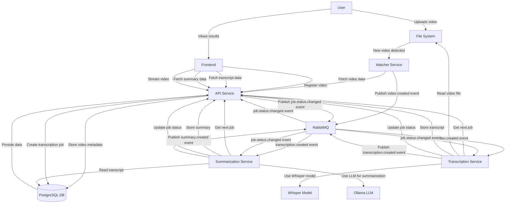

# Video Transcriber

Privacy-first application for automatic video transcription, summarization, translation, and transcript review.

## Overview

Video Transcriber is a hobby project for processing video files, generating transcriptions, and creating summaries.

## Features

- **Automatic Video Detection**: Monitors directories for new video files
- **Speech-to-Text Transcription**: Converts spoken content to text using WhisperX
- **AI-Powered Summarization**: Generates concise summaries using Ollama
- **On-Demand Translation**: Creates translated transcripts for supported languages
- **Web Interface**: Frontend for viewing videos, transcripts, summaries, and translations
- **REST API + SSE**: Programmatic access plus live status updates
- **Lease-Based Job Processing**: Race-safe multi-worker claiming backed by PostgreSQL

## Architecture

The application follows a microservices architecture with the following components:


```mermaid
graph TD
    User[User]
    FileSystem[File System]
    Watcher[Watcher Service]
    API[API Service]
    TranscriptionWorker[Transcription Service]
    SummarizationWorker[Summarization Service]
    RabbitMQ[RabbitMQ]
    Postgres[(PostgreSQL DB)]
    Ollama[Ollama LLM]
    Frontend[Frontend]
    Whisper[Whisper Model]

    User -->|Uploads video| FileSystem
    User -->|Views results| Frontend

    FileSystem -->|New video detected| Watcher
    Watcher -->|Register video| API
    Watcher -->|Publish video.created event| RabbitMQ

    API -->|Store video metadata| Postgres
    API -->|Create transcription job| Postgres
    API -->|Publish job.status.changed event| RabbitMQ

    TranscriptionWorker -->|Get next job| API
    TranscriptionWorker -->|Read video file| FileSystem
    TranscriptionWorker -->|Use Whisper model| Whisper
    TranscriptionWorker -->|Store transcript| API
    TranscriptionWorker -->|Update job status| API
    TranscriptionWorker -->|Publish transcription.created event| RabbitMQ

    SummarizationWorker -->|Get next job| API
    SummarizationWorker -->|Read transcript| Postgres
    SummarizationWorker -->|Use LLM for summarization| Ollama
    SummarizationWorker -->|Store summary| API
    SummarizationWorker -->|Update job status| API
    SummarizationWorker -->|Publish summary.created event| RabbitMQ

    Frontend -->|Fetch video data| API
    Frontend -->|Fetch transcript data| API
    Frontend -->|Fetch summary data| API
    Frontend -->|Stream video| API

    RabbitMQ -->|video.created event| TranscriptionWorker
    RabbitMQ -->|job.status.changed event| TranscriptionWorker
    RabbitMQ -->|transcription.created event| SummarizationWorker
    RabbitMQ -->|job.status.changed event| SummarizationWorker
    RabbitMQ -->|job.status.changed event| API

    Postgres -->|Provide data| API
```

### Services

- **API Service**: HTTP API for video management, transcript/summary retrieval, and job monitoring
- **Transcription Service**: Processes videos and generates transcripts using Whisper
- **Summarization Service**: Creates summaries from transcripts using Ollama LLM
- **Watcher Service**: Monitors directories for new video files
- **Frontend**: React-based web interface for user interaction

### Communication

The system uses a combination of two approaches for service communication:

1. **Event-Driven Wake-Ups**: Services subscribe to RabbitMQ events as wake-up signals
2. **API Job Leasing**: Workers atomically claim and heartbeat jobs through the API

## Installation

### Prerequisites

- Docker with `docker compose`
- Git

### Quick Start

1. Clone the repository:

   ```bash
   git clone https://github.com/yourusername/video-transcriber.git
   cd video-transcriber
   ```

2. Configure video directories (optional):

   ```bash
   cp .env.example .env
   # Edit .env to configure VIDEO_DIRS and HOST_VIDEO_PATHS
   ```

3. Set up dynamic volume mounts and start the application:

   ```bash
   make up
   ```

   Or manually:

   ```bash
   ./scripts/setup-volumes.sh
   docker compose up
   ```

### Dynamic Video Directory Mounting

The application supports automatically mounting multiple video directories from your host machine. This allows you to process videos from different locations without manually copying them.

**Configuration:**

Edit your `.env` file:

```bash
# Container paths where videos will be accessible
VIDEO_DIRS=/app/data/videos,/app/custom_videos,/app/external_videos

# Corresponding host directories (optional)
HOST_VIDEO_PATHS=/home/user/videos,/media/external/movies,/data/recordings
```

**Usage:**

```bash
# Generate volume mounts and start services
make up

# Or run setup manually
./scripts/setup-volumes.sh
docker compose up
```

For detailed configuration options, see [docs/operations/docker-volumes.md](docs/operations/docker-volumes.md).

## Usage

### Processing Videos

1. Place video files in the `data/videos` directory
2. The system will automatically detect, transcribe, and summarize the videos
3. View the results in the web interface

## API Endpoints

### Videos

- `POST /videos/upload`: Upload a new video
- `GET /videos`: List all videos
- `GET /videos/{video_id}`: Get video details
- `POST /videos/register`: Register an existing on-disk video with optional `storage_path`

### Transcripts

- `GET /transcripts`: List all transcripts
- `GET /transcripts/{transcript_id}`: Get transcript details
- `GET /transcripts/video/{video_id}`: Get transcript for a video

### Summaries

- `GET /summaries`: List all summaries
- `GET /summaries/{summary_id}`: Get summary details

### Translations

- `POST /translation-jobs`: Create an on-demand translation job
- `GET /translation-jobs`: List translation jobs
- `GET /translated-transcripts`: List translated transcripts
- `PUT /translated-transcripts/{translated_transcript_id}/segments`: Update translated transcript segments

### Lease-Based Worker Endpoints

- `POST /transcription-jobs/claim`
- `POST /summarization-jobs/claim`
- `POST /translation-jobs/claim`
- `POST /transcription-jobs/{job_id}/heartbeat`
- `POST /summarization-jobs/{job_id}/heartbeat`
- `POST /translation-jobs/{job_id}/heartbeat`

## Development

### Project Structure

```
video-transcriber/
├── common/                 # Shared code between services
├── data/                   # Data storage
│   ├── videos/             # Video files
├── docs/                   # Architecture and operational notes
├── frontend/               # React frontend
├── services/               # Backend services
│   ├── api_service/        # HTTP API
│   ├── transcription_service/ # Video transcription
│   ├── summarization_service/ # Transcript summarization
│   ├── translation_service/ # Transcript translation
│   └── watcher_service/    # File system monitoring
├── scripts/                # Local smoke and helper scripts
├── tests/                  # Integration and manual verification
└── docker-compose.yml      # Docker configuration
```

### Local Development

For local development, use the service-local `pyproject.toml` and `Dockerfile` files together with the repo-level notes under `docs/`.

## Configuration

The application can be configured through environment variables:

- `VIDEO_DIRS`: Directories to monitor for videos (default: `/app/data/videos`)
- `MAX_WORKERS`: Maximum number of transcription worker threads (default: `2`)
- `LLM_HOST`: URL of the Ollama API (default: `http://ollama:11434/api/generate`)
- `SUMMARIZATION_LLM_MODEL`: Ollama model used by the summarization worker (default: `mistral-small3.1`)
- `TRANSLATION_LLM_MODEL`: Ollama model used by the translation worker (default: `qwen3:14b`)
- `LLM_MODEL`: Shared fallback when a task-specific model is not set (default: `qwen3:14b`)
- `JOB_HEARTBEAT_INTERVAL_SECONDS`: Lease heartbeat cadence for workers (default: `60`)
- `JOB_CLAIM_POLL_SECONDS`: Fallback claim poll interval when no wake-up event is received (default: `15`)

## Operations

- Backend API and schema contract: `docs/architecture/foundation-sprint-contract.md`
- Architecture flow notes: `docs/architecture/data-flow-diagram.md`
- Production runtime note for PostgreSQL 14 to 16 upgrades: `docs/operations/production-notes.md`
- Dynamic volume mounting guide: `docs/operations/docker-volumes.md`
- Local smoke run: `scripts/smoke-compose.sh`

## Model Benchmarking

Use `scripts/benchmark_ollama_models.py` to compare candidate Ollama models against a real transcript. The script can read a transcript JSON export or pull the latest transcript from the local API, then write Markdown and JSON reports under `data/benchmarks/`.

Examples:

```bash
python3 scripts/benchmark_ollama_models.py --latest-transcript
python3 scripts/benchmark_ollama_models.py --input /path/to/transcript.json --summary-model mistral-small3.1 --summary-model qwen3:14b
python3 scripts/benchmark_ollama_models.py --task translation --latest-transcript --translation-model qwen3:14b --translation-model deepseek-r1 --target-language de
```
