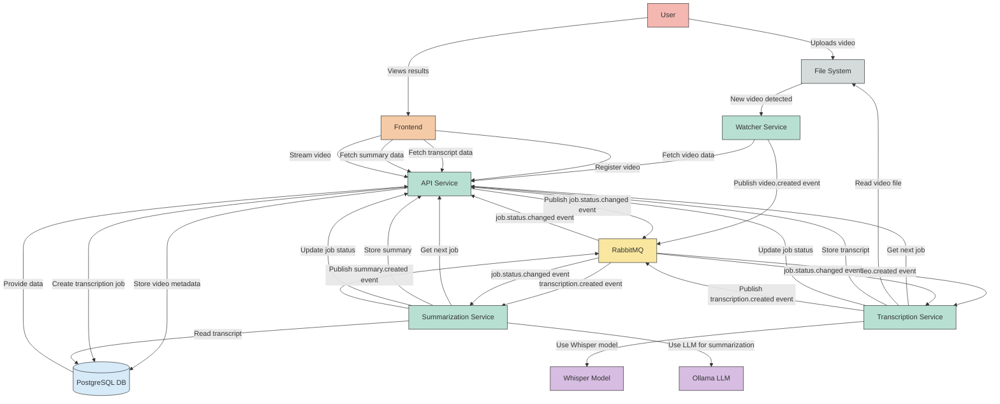

# Video Transcriber Data Flow Diagram

## Data Flow Description

1. **Video Ingestion**:

   - User uploads a video or places it in a monitored directory
   - Watcher Service detects the new video file
   - Watcher registers the video with the API Service
   - API Service stores video metadata in PostgreSQL
   - Watcher publishes a `video.created` event to RabbitMQ

2. **Transcription Process**:

   - API Service creates a transcription job in PostgreSQL
   - Transcription Service receives a `video.created` event from RabbitMQ
   - Transcription Service also listens for `job.status.changed` events
   - Transcription Service checks for pending jobs at startup (polling)
   - Transcription Service processes the video using Whisper model
   - Transcription Service stores the transcript via API
   - Transcription Service publishes a `transcription.created` event

3. **Summarization Process**:

   - API Service creates a summarization job
   - Summarization Service receives a `transcription.created` event from RabbitMQ
   - Summarization Service also listens for `job.status.changed` events
   - Summarization Service checks for pending jobs at startup (polling)
   - Summarization Service uses Ollama LLM to generate a summary
   - Summarization Service stores the summary via API
   - Summarization Service publishes a `summary.created` event

4. **Frontend Display**:
   - Frontend fetches video, transcript, and summary data from API
   - Frontend displays video with synchronized transcript
   - Frontend shows summary of the video content
   - User can interact with the video and transcript

This architecture uses a microservices approach with message-based communication through RabbitMQ, allowing for scalable and resilient processing of videos.

## Event-Driven vs. Polling Approaches

This system uses a combination of two approaches for service communication:

1. **Event-Driven (Push Model)**:

   - Services subscribe to specific events via RabbitMQ
   - When an event occurs, RabbitMQ pushes the notification to all subscribed services
   - Example: When a transcription is created, RabbitMQ notifies the Summarization Service
   - Advantages: Real-time processing, reduced latency, services only act when needed

2. **Polling (Pull Model)**:
   - Services periodically check the API for pending jobs
   - The service actively requests information rather than waiting for notifications
   - Example: Services check for pending jobs at startup to process any jobs that might have been missed
   - Advantages: Simpler implementation, works as a fallback mechanism

Using both approaches provides redundancy and ensures that no jobs are missed, even if a service was temporarily unavailable when an event was published.
