# Video Transcriber Data Flow Diagram

```mermaid
graph TD
    %% Define nodes
    User[User]
    FileSystem[File System]
    Watcher[Watcher Service]
    API[API Service]
    TranscriptionWorker[Transcription Service]
    SummarizationWorker[Summarization Service]
    TranslationWorker[Translation Service]
    Postgres[(PostgreSQL DB)]
    Ollama[Ollama LLM]
    Frontend[Frontend]
    Whisper[Whisper Model]

    %% Define styles
    classDef service fill:#b8e0d2,stroke:#333,stroke-width:1px;
    classDef database fill:#d6eaf8,stroke:#333,stroke-width:1px;
    classDef model fill:#d7bde2,stroke:#333,stroke-width:1px;
    classDef frontend fill:#f5cba7,stroke:#333,stroke-width:1px;
    classDef storage fill:#d5dbdb,stroke:#333,stroke-width:1px;
    classDef user fill:#f5b7b1,stroke:#333,stroke-width:1px;

    %% Apply styles
    class Watcher,API,TranscriptionWorker,SummarizationWorker,TranslationWorker service;
    class Postgres database;
    class Whisper,Ollama model;
    class Frontend frontend;
    class FileSystem storage;
    class User user;

    %% Define relationships
    User -->|Uploads video| FileSystem
    User -->|Views results| Frontend

    %% Watcher Service Flow
    FileSystem -->|New video detected| Watcher
    Watcher -->|Register video| API

    %% API Service Flow
    API -->|Store video metadata| Postgres
    API -->|Create transcription job| Postgres
    API -->|Create summarization job| Postgres
    API -->|Create translation job| Postgres

    %% Transcription Service Flow
    TranscriptionWorker -->|Claim leased job| API
    TranscriptionWorker -->|Read video file| FileSystem
    TranscriptionWorker -->|Use Whisper model| Whisper
    TranscriptionWorker -->|Store transcript| API
    TranscriptionWorker -->|Update job status| API

    %% Summarization Service Flow
    SummarizationWorker -->|Claim leased job| API
    SummarizationWorker -->|Read transcript| Postgres
    SummarizationWorker -->|Use LLM for summarization| Ollama
    SummarizationWorker -->|Store summary| API
    SummarizationWorker -->|Update job status| API

    %% Translation Service Flow
    TranslationWorker -->|Claim leased job| API
    TranslationWorker -->|Read transcript| Postgres
    TranslationWorker -->|Use LLM for translation| Ollama
    TranslationWorker -->|Store translation| API
    TranslationWorker -->|Update job status| API

    %% Frontend Flow
    Frontend -->|Fetch video data| API
    Frontend -->|Fetch transcript data| API
    Frontend -->|Fetch summary data| API
    Frontend -->|Fetch translations| API
    Frontend -->|Stream video| API

    %% Database Relationships
    Postgres -->|Provide data| API
```

## Data Flow Description

1. **Video Ingestion**:

   - User uploads a video or places it in a monitored directory
   - Watcher Service detects the new video file
   - Watcher registers the video with the API Service
   - API Service stores video metadata in PostgreSQL
   - API Service creates a transcription job in PostgreSQL

2. **Transcription Process**:

   - Transcription Service polls the API for claimable jobs
   - Transcription Service claims jobs through the API leasing endpoints
   - Transcription Service heartbeats while processing long-running work
   - Transcription Service processes the video using Whisper model
   - Transcription Service stores the transcript via API
   - API Service creates downstream summarization and translation jobs in PostgreSQL

3. **Summarization Process**:

   - API Service creates a summarization job
   - Summarization Service polls the API for claimable jobs
   - Summarization Service claims jobs through the API leasing endpoints
   - Summarization Service heartbeats while processing long-running work
   - Summarization Service uses Ollama LLM to generate a summary
   - Summarization Service stores the summary via API

4. **Translation Process**:

   - API Service creates a translation job
   - Translation Service polls the API for claimable jobs
   - Translation Service claims jobs through the API leasing endpoints
   - Translation Service heartbeats while processing long-running work
   - Translation Service uses Ollama to generate translations
   - Translation Service stores translated transcript data via API

5. **Frontend Display**:
   - Frontend fetches video, transcript, summary, and translation data from API
   - Frontend displays video with synchronized transcript
   - Frontend shows generated summaries and translated transcripts
   - User can interact with the video and transcript

This architecture uses API-centered service decomposition with PostgreSQL-backed leasing, allowing multiple workers to poll safely without a separate message broker.

## Polling and API Leasing

This system uses a combination of two approaches for service communication:

1. **Timed Polling**:

   - Workers poll the claim endpoints on startup and at a short interval
   - Polling provides deterministic behavior without a separate broker dependency
   - Example: when a transcription completes, the API stores the summarization job and the summarization worker claims it on its next poll
   - Advantages: simpler topology and fewer operational moving parts

2. **API Job Leasing**:

   - Workers atomically claim jobs through the API and extend ownership with heartbeats
   - PostgreSQL-backed leases prevent multiple workers from processing the same job
   - Workers can still claim on startup or on the next polling interval when no job is immediately available
   - Advantages: race-safe ownership with predictable recovery from stalled workers

Using short polling plus PostgreSQL-backed leases keeps ownership deterministic while removing RabbitMQ as a separate infrastructure dependency.
