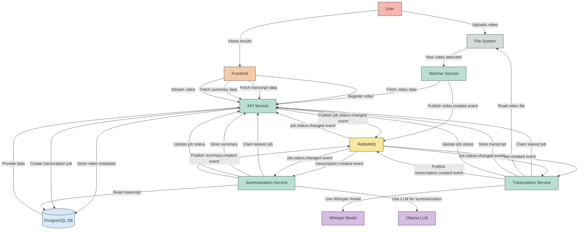

# Video Transcriber Data Flow Diagram

## Data Flow Description

1. **Video Ingestion**:

   - User uploads a video or places it in a monitored directory
   - Watcher Service detects the new video file
   - Watcher registers the video with the API Service
   - API Service stores video metadata in PostgreSQL
   - Watcher publishes a `video.created` event to RabbitMQ

2. **Transcription Process**:

   - API Service creates a transcription job in PostgreSQL
   - Transcription Service receives wake-up events from RabbitMQ
   - Transcription Service claims jobs through the API leasing endpoints
   - Transcription Service heartbeats while processing long-running work
   - Transcription Service processes the video using Whisper model
   - Transcription Service stores the transcript via API
   - Transcription Service publishes a `transcription.created` event

3. **Summarization Process**:

   - API Service creates a summarization job
   - Summarization Service receives wake-up events from RabbitMQ
   - Summarization Service claims jobs through the API leasing endpoints
   - Summarization Service heartbeats while processing long-running work
   - Summarization Service uses Ollama LLM to generate a summary
   - Summarization Service stores the summary via API
   - Summarization Service publishes a `summary.created` event

4. **Frontend Display**:
   - Frontend fetches video, transcript, and summary data from API
   - Frontend displays video with synchronized transcript
   - Frontend shows summary of the video content
   - User can interact with the video and transcript

This architecture uses a microservices approach with message-based communication through RabbitMQ, allowing for scalable and resilient processing of videos.

## Event-Driven Wake-Ups and API Leasing

This system uses a combination of two approaches for service communication:

1. **Event-Driven Wake-Ups**:

   - Services subscribe to relevant events via RabbitMQ
   - RabbitMQ acts as a wake-up signal so workers know when to attempt another claim
   - Example: When a transcription is created, RabbitMQ notifies the Summarization Service
   - Advantages: low latency and less idle polling

2. **API Job Leasing**:
   - Workers atomically claim jobs through the API and extend ownership with heartbeats
   - PostgreSQL-backed leases prevent multiple workers from processing the same job
   - Workers can still claim on startup or on a timed fallback when no wake-up event is received
   - Advantages: race-safe ownership with predictable recovery from stalled workers

Using both approaches provides low-latency wake-ups without making RabbitMQ the source of truth for job ownership.
