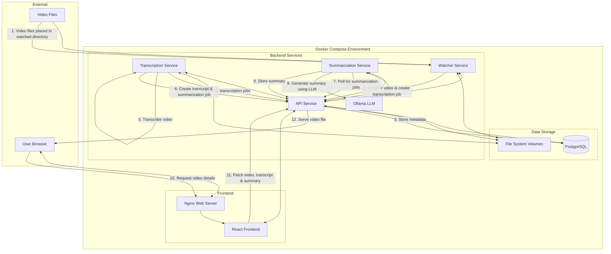

# Video Transcriber Architecture

## Deployment Architecture

The Video Transcriber application is deployed using Docker Compose, which orchestrates multiple containerized services. Each service is responsible for a specific part of the application's functionality.

### Services

1. **Frontend**

   - **React Frontend**: A React application that provides the user interface
   - **Nginx Web Server**: Serves the React application and acts as a reverse proxy for API requests

2. **Backend Services**

   - **API Service**: FastAPI application that provides REST API endpoints for all operations
   - **Transcription Service**: Worker service that transcribes videos using Whisper
   - **Summarization Service**: Worker service that summarizes transcripts using Ollama LLM
   - **Watcher Service**: Monitors a directory for new video files
   - **Ollama LLM**: Local large language model service for generating summaries

3. **Data Storage**
   - **PostgreSQL**: Relational database for storing metadata, transcripts, and summaries
   - **File System Volumes**: Docker volumes for storing video files and other data

### Container Configuration

The services are configured in the `docker-compose.yml` file, which defines:

- Container images and build contexts
- Environment variables
- Volume mounts
- Port mappings
- Service dependencies
- Health checks
- Restart policies
- Logging configuration

### Data Flow

1. A user uploads a video through the frontend or places a video file in the watched directory
2. The watcher service detects the new video file and registers it with the API service
3. The API service creates a transcription job for the video
4. The transcription service polls for pending transcription jobs
5. When a job is found, the transcription service transcribes the video using Whisper
6. The transcription service creates a transcript and a summarization job
7. The summarization service polls for pending summarization jobs
8. When a job is found, the summarization service summarizes the transcript using Ollama LLM
9. The summarization service creates a summary
10. A user navigates to the video detail page in the frontend
11. The frontend fetches the video, transcript, and summary from the API service
12. The frontend displays the video, transcript, and summary to the user

### Scalability and Reliability

- Each service is containerized and can be scaled independently
- Services are configured to restart automatically if they fail
- Health checks ensure that services are running correctly
- Logging is configured to help with debugging and monitoring
- The database is persisted using a Docker volume
- Video files are stored in a shared volume accessible by multiple services

### Security Considerations

- The API service is the only service exposed to the frontend
- The database is not directly accessible from outside the Docker network
- Environment variables are used for configuration to avoid hardcoding sensitive information
- The Ollama LLM service is only accessible from within the Docker network
