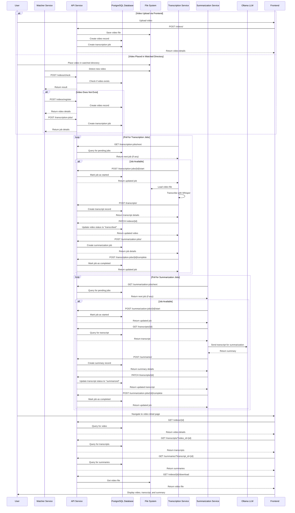

# Video Transcriber Data Flow

## Data Models

### Video

- `id`: Unique identifier
- `filename`: Name of the video file
- `status`: Current status (pending, transcribed, error)
- `created_at`: Timestamp when the video was added
- `file_hash`: Hash of the video file for deduplication
- `video_metadata`: Additional metadata about the video

### Transcript

- `id`: Unique identifier
- `video_id`: Reference to the video
- `source_type`: Type of source (video)
- `content`: Full transcript text
- `format`: Format of the transcript (txt, srt)
- `status`: Current status (completed, summarized, error)
- `created_at`: Timestamp when the transcript was created
- `segments`: Time-aligned segments of the transcript

### Summary

- `id`: Unique identifier
- `transcript_id`: Reference to the transcript
- `content`: Summary text
- `status`: Current status (completed, error)
- `created_at`: Timestamp when the summary was created

### TranscriptionJob

- `id`: Unique identifier
- `video_id`: Reference to the video
- `status`: Current status (pending, in_progress, completed, failed)
- `created_at`: Timestamp when the job was created
- `started_at`: Timestamp when the job was started
- `completed_at`: Timestamp when the job was completed
- `processing_time_seconds`: Time taken to process the job
- `error_details`: Details of any errors that occurred

### SummarizationJob

- `id`: Unique identifier
- `transcript_id`: Reference to the transcript
- `status`: Current status (pending, in_progress, completed, failed)
- `created_at`: Timestamp when the job was created
- `started_at`: Timestamp when the job was started
- `completed_at`: Timestamp when the job was completed
- `processing_time_seconds`: Time taken to process the job
- `error_details`: Details of any errors that occurred

## API Endpoints

### Video Endpoints

- `GET /videos/`: List all videos
- `GET /videos/{id}`: Get a video by ID
- `POST /videos/`: Upload a new video
- `POST /videos/register`: Register an existing video file
- `POST /videos/check`: Check if a video exists
- `PATCH /videos/{id}`: Update a video
- `GET /videos/{id}/download`: Download a video

### Transcript Endpoints

- `GET /transcripts/`: List all transcripts
- `GET /transcripts/{id}`: Get a transcript by ID
- `POST /transcripts/`: Create a new transcript
- `PATCH /transcripts/{id}`: Update a transcript

### Summary Endpoints

- `GET /summaries/`: List all summaries
- `GET /summaries/{id}`: Get a summary by ID
- `POST /summaries/`: Create a new summary

### Transcription Job Endpoints

- `POST /transcription-jobs/`: Create a new transcription job
- `GET /transcription-jobs/next`: Get the next pending transcription job
- `GET /transcription-jobs/{id}`: Get a transcription job by ID
- `POST /transcription-jobs/{id}/start`: Mark a transcription job as started
- `POST /transcription-jobs/{id}/complete`: Mark a transcription job as completed
- `POST /transcription-jobs/{id}/fail`: Mark a transcription job as failed
- `POST /transcription-jobs/{id}/retry`: Retry a failed transcription job

### Summarization Job Endpoints

- `POST /summarization-jobs/`: Create a new summarization job
- `GET /summarization-jobs/next`: Get the next pending summarization job
- `GET /summarization-jobs/{id}`: Get a summarization job by ID
- `POST /summarization-jobs/{id}/start`: Mark a summarization job as started
- `POST /summarization-jobs/{id}/complete`: Mark a summarization job as completed
- `POST /summarization-jobs/{id}/fail`: Mark a summarization job as failed
