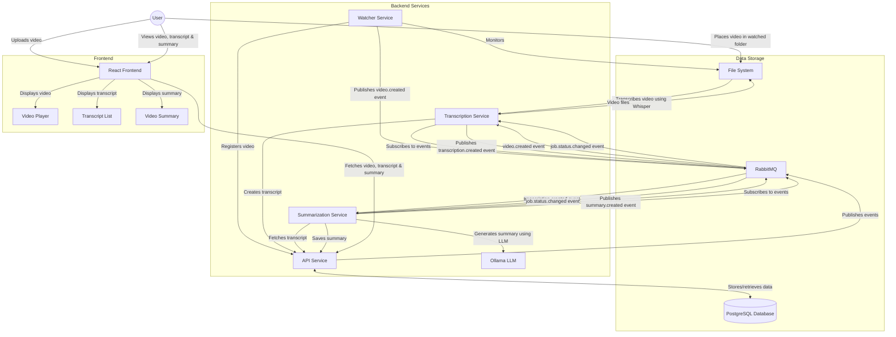

# Video Transcriber Application Flow

## Detailed Process Flow

1. **Video Ingestion**:

   - User uploads a video through the frontend OR places a video file in the watched directory
   - The video file is stored in the file system
   - The video is registered in the database
   - A `video.created` event is published to RabbitMQ

2. **Transcription Process**:

   - The transcription service subscribes to `video.created` events
   - When an event is received, the service:
     - Loads the Whisper model
     - Transcribes the video
     - Creates a transcript with time-aligned segments
     - Updates the video status to "transcribed"
     - Publishes a `transcription.created` event to RabbitMQ

3. **Summarization Process**:

   - The summarization service subscribes to `transcription.created` events
   - When an event is received, the service:
     - Fetches the transcript
     - Sends the transcript to the Ollama LLM for summarization
     - Saves the summary
     - Updates the transcript status to "summarized"
     - Publishes a `summary.created` event to RabbitMQ

4. **Frontend Display**:
   - The frontend fetches the video, transcript, and summary
   - Displays the video with a player
   - Shows the transcript with time-aligned segments
   - Displays the summary
   - Allows the user to click on transcript segments to seek to that point in the video

## Components

### Services

- **Watcher Service**: Monitors a directory for new video files
- **API Service**: Provides REST API endpoints for all operations
- **Transcription Service**: Transcribes videos using Whisper
- **Summarization Service**: Summarizes transcripts using Ollama LLM
- **RabbitMQ**: Message broker for event-based communication between services

### Data Storage

- **PostgreSQL Database**: Stores metadata, transcripts, and summaries
- **File System**: Stores video files

### Frontend

- **React Frontend**: User interface for the application
- **Video Player**: Displays the video
- **Transcript List**: Shows the transcript with time-aligned segments
- **Video Summary**: Displays the summary of the video content

## Event Types

The system uses the following event types for communication between services:

1. **video.created**: Published when a new video is registered in the system

   - Payload: `{ "video_id": "uuid", "filename": "video.mp4" }`
   - Publisher: API Service, Watcher Service
   - Subscribers: Transcription Service

2. **transcription.created**: Published when a video has been transcribed

   - Payload: `{ "transcript_id": "uuid", "video_id": "uuid" }`
   - Publisher: API Service, Transcription Service
   - Subscribers: Summarization Service

3. **summary.created**: Published when a transcript has been summarized

   - Payload: `{ "summary_id": "uuid", "transcript_id": "uuid" }`
   - Publisher: API Service, Summarization Service
   - Subscribers: (Currently none, but could be used for notifications or further processing)

4. **job.status.changed**: Published when a job status changes
   - Payload: `{ "job_type": "transcription|summarization", "job_id": "uuid", "status": "pending|processing|completed|failed" }`
   - Publisher: API Service
   - Subscribers: Transcription Service, Summarization Service

## Fallback Mechanism

Each service includes a fallback mechanism to handle situations where RabbitMQ is unavailable:

1. If a service cannot publish an event to RabbitMQ, it will fall back to using the API directly
2. Services can operate in both event-based mode and polling mode
3. On startup, services check for any pending jobs that might have been missed while they were offline
