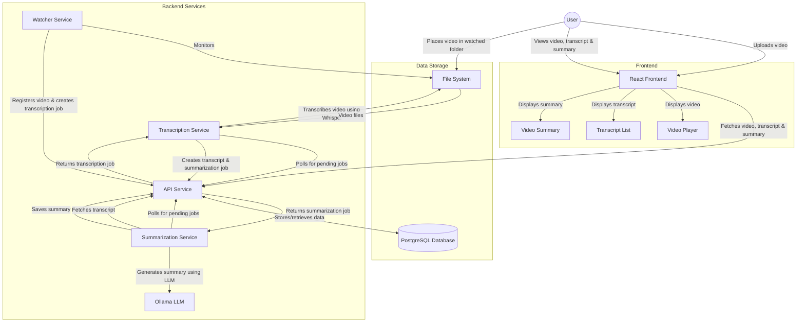

# Video Transcriber Application Flow

## Detailed Process Flow

1. **Video Ingestion**:

   - User uploads a video through the frontend OR places a video file in the watched directory
   - The video file is stored in the file system
   - The video is registered in the database

2. **Transcription Process**:

   - The transcription service polls for pending transcription jobs
   - When a job is found, the service:
     - Loads the Whisper model
     - Transcribes the video
     - Creates a transcript with time-aligned segments
     - Updates the video status to "transcribed"
     - Creates a summarization job

3. **Summarization Process**:

   - The summarization service polls for pending summarization jobs
   - When a job is found, the service:
     - Fetches the transcript
     - Sends the transcript to the Ollama LLM for summarization
     - Saves the summary
     - Updates the transcript status to "summarized"

4. **Frontend Display**:
   - The frontend fetches the video, transcript, and summary
   - Displays the video with a player
   - Shows the transcript with time-aligned segments
   - Displays the summary
   - Allows the user to click on transcript segments to seek to that point in the video

## Components

### Services

- **Watcher Service**: Monitors a directory for new video files
- **API Service**: Provides REST API endpoints for all operations
- **Transcription Service**: Transcribes videos using Whisper
- **Summarization Service**: Summarizes transcripts using Ollama LLM

### Data Storage

- **PostgreSQL Database**: Stores metadata, transcripts, and summaries
- **File System**: Stores video files

### Frontend

- **React Frontend**: User interface for the application
- **Video Player**: Displays the video
- **Transcript List**: Shows the transcript with time-aligned segments
- **Video Summary**: Displays the summary of the video content
